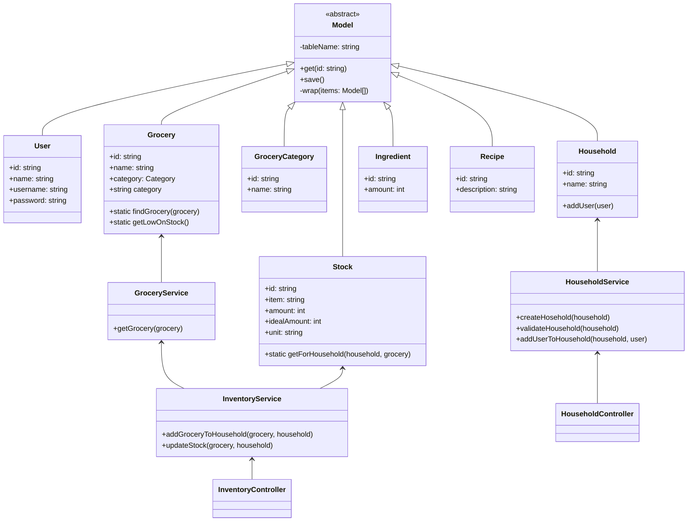

# Class Diagram (backend)

```mermaid
classDiagram
class Model {
    <<abstract>>
    -tableName: string
    +get(id: string)
    +save()
    -wrap(items: Model[])
}
class User {
    +id: string
    +name: string
    +username: string
    +password: string
}
class Grocery {
    +id: string
    +name: string
    +category: Category
    +string category
    +static findGrocery(grocery)
    +static getLowOnStock()
}
class GroceryCategory {
    +id: string
    +name: string
}
class Stock {
    +id: string
    +item: string
    +amount: int
    +idealAmount: int
    +unit: string
    +static getForHousehold(household, grocery)
}
class Household {
    +id: string
    +name: string
    +addUser(user)
}
class Ingredient {
    +id: string
    +amount: int
}
class Recipe {
    +id: string
    +description: string
}
class HouseholdService {
    +createHosehold(household)
    +validateHousehold(household)
    +addUserToHousehold(household, user)
}
class InventoryService {
    +addGroceryToHousehold(grocery, household)
    +updateStock(grocery, household)
}
class GroceryService {
    +getGrocery(grocery)
}
class InventoryController {
    
}
class HouseholdController {
    
}
Model <|-- Household
Model <|-- Stock
Model <|-- User
Model <|-- Grocery
Model <|-- GroceryCategory
Model <|-- Recipe
Model <|-- Ingredient
Household <-- HouseholdService 
Grocery <-- GroceryService 
GroceryService <-- InventoryService 
Stock <-- InventoryService 
InventoryService <-- InventoryController 
HouseholdService <-- HouseholdController 
```