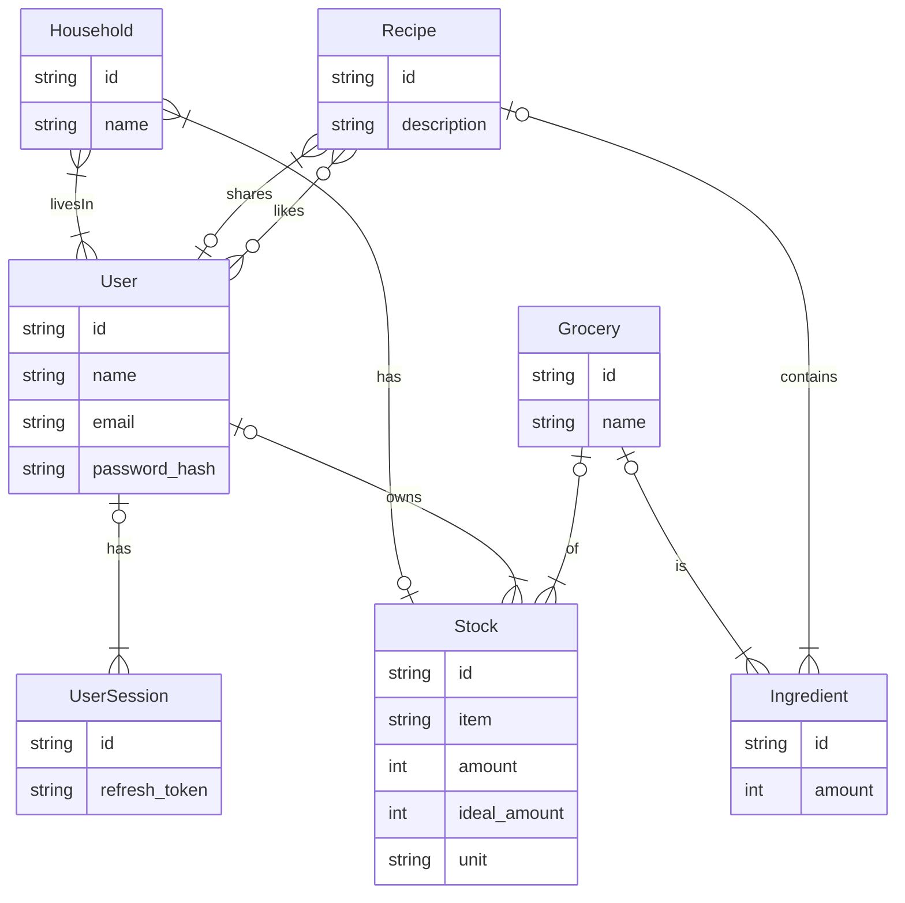

# ER-Diagram

An up-to-date diagram showing the ER-Diagram of the `Model` layer of wastend's architecture.

```mermaid
erDiagram
    User {
        string id
        string name
        string email
        string password_hash
    }
    Grocery {
        string id
        string name
    }
    Stock {
        string id
        string item
        int amount
        int ideal_amount
        string unit
    }
    Household {
        string id
        string name
    }
    Ingredient {
        string id
        int amount
    }
    Recipe {
        string id
        string description
    }
    UserSession {
        string id
        string refresh_token
    }
    Household }|--|{ User : livesIn
    Household }|--|o Stock : has
    Recipe }|--|o User : shares
    User o|--|{ UserSession : has
    User o|--|{ Stock : owns
    Grocery o|--|{ Stock : of
    Grocery o|--|{ Ingredient : is
    Recipe o|--|{ Ingredient : contains
    Recipe o{--}o User : likes
```