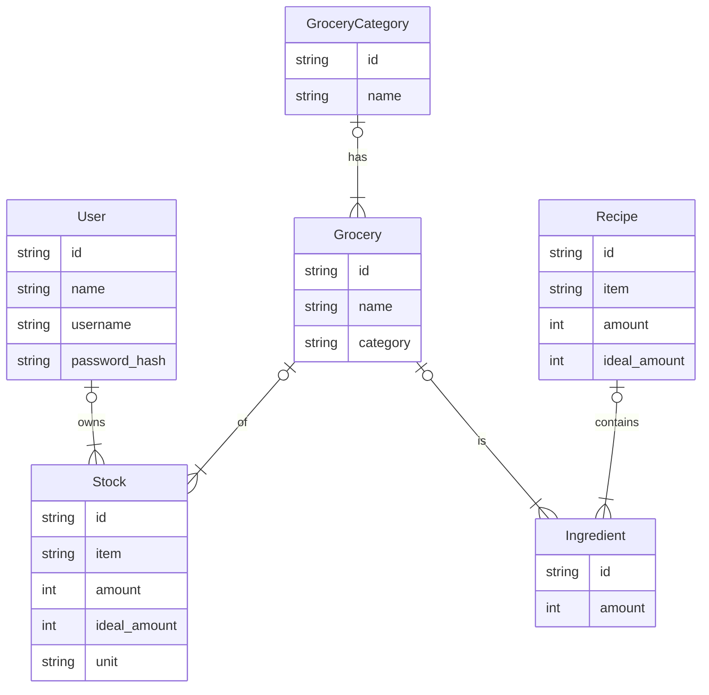

# ER-Diagram

```mermaid
erDiagram
    User {
        string id
        string name
        string username
        string password_hash
    }
    Grocery {
        string id
        string name
        string category
    }
    GroceryCategory {
        string id
        string name
    }
    Stock {
        string id
        string item
        int amount
        int ideal_amount
        string unit
    }
    Ingredient {
        string id
        int amount
    }
    Recipe {
        string id
        string item
        int amount
        int ideal_amount
    }
    GroceryCategory o|--|{ Grocery : has
    User o|--|{ Stock : owns
    Grocery o|--|{ Stock : of
    Grocery o|--|{ Ingredient : is
    Recipe o|--|{ Ingredient : contains
```