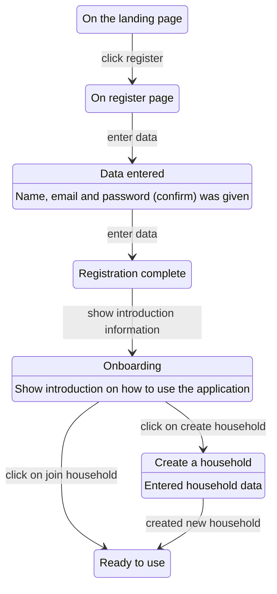
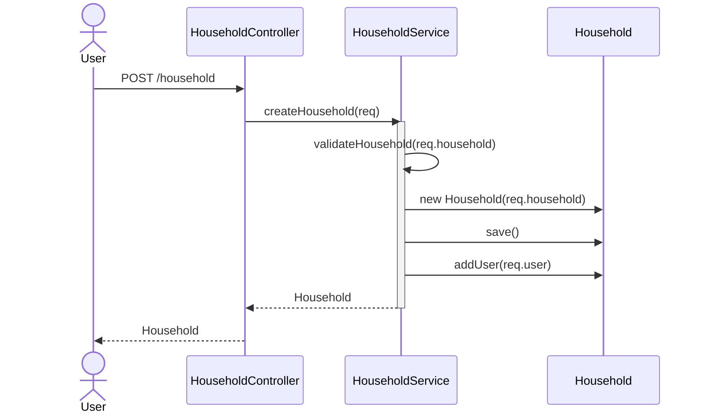
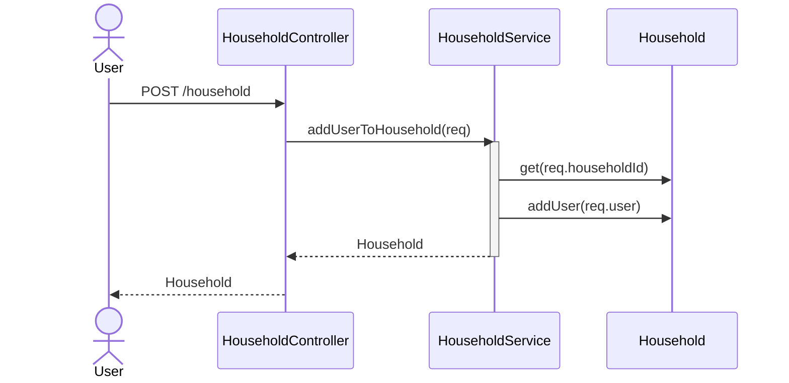

# User Journeys
This section will give a deeper look into some activities that users can perform using wastend.

## Onboarding

```mermaid
stateDiagram-v2
    state "On the landing page" as landing_page
    state "On register page" as register
    state "Data entered" as register_data
    state "Name, email and password (confirm) was given" as register_data
    state "Registration complete" as register_complete
    state "Onboarding" as onboard
    state "Show introduction on how to use the application" as onboard
    state "Create a household" as create_household
    state "Entered household data" as create_household
    state "Ready to use" as ready
    
    landing_page --> register: click register
    register --> register_data: enter data
    register_data --> register_complete: enter data
    register_complete --> onboard: show introduction information
    onboard --> create_household: click on create household
    onboard --> ready: click on join household
    create_household --> ready: created new household
```
## Create household

```mermaid
sequenceDiagram
    actor User
    User ->> HouseholdController: POST /household
    HouseholdController ->> HouseholdService: createHousehold(req)
    activate HouseholdService
    HouseholdService ->> HouseholdService: validateHousehold(req.household)
    HouseholdService ->> Household: new Household(req.household)
    HouseholdService ->> Household: save()
    HouseholdService ->> Household: addUser(req.user)
    HouseholdService -->> HouseholdController: Household
    deactivate HouseholdService
    HouseholdController -->> User: Household
```
## Add user to household

```mermaid
sequenceDiagram
    actor User
    User ->> HouseholdController: POST /household
    HouseholdController ->> HouseholdService: addUserToHousehold(req)
    activate HouseholdService
    HouseholdService ->> Household: get(req.householdId)
    HouseholdService ->> Household: addUser(req.user)
    HouseholdService -->> HouseholdController: Household
    deactivate HouseholdService
    HouseholdController -->> User: Household
```
