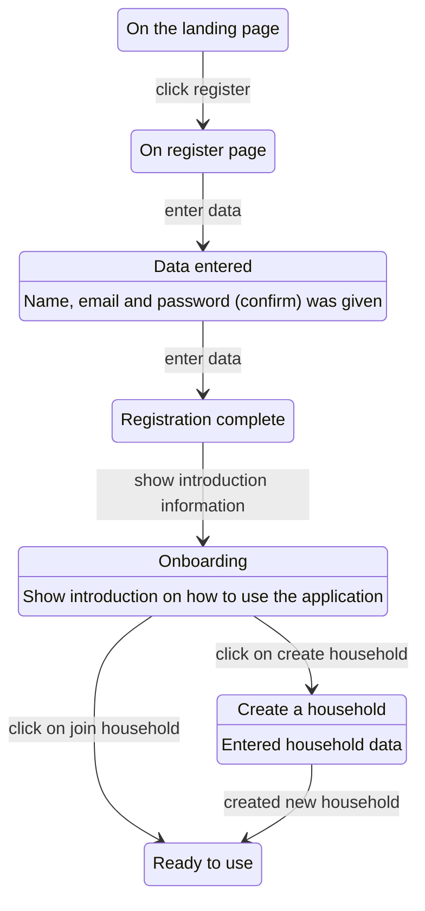
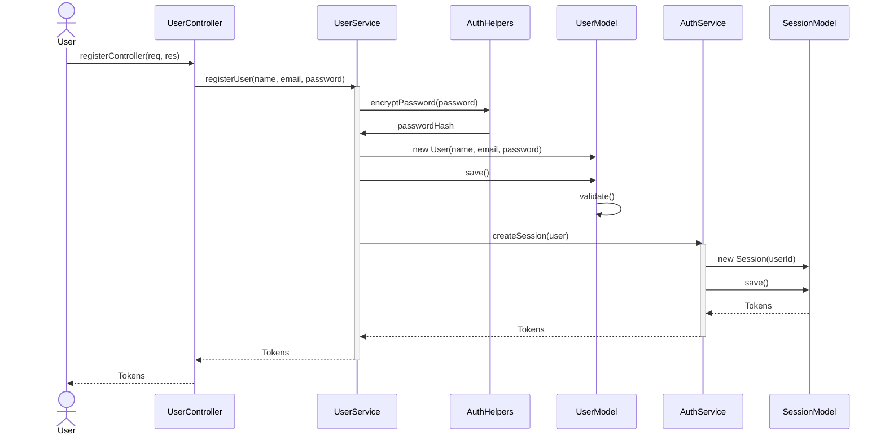
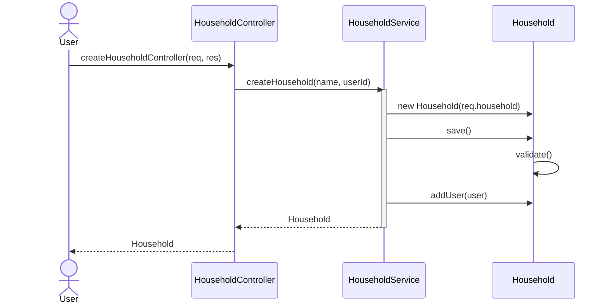
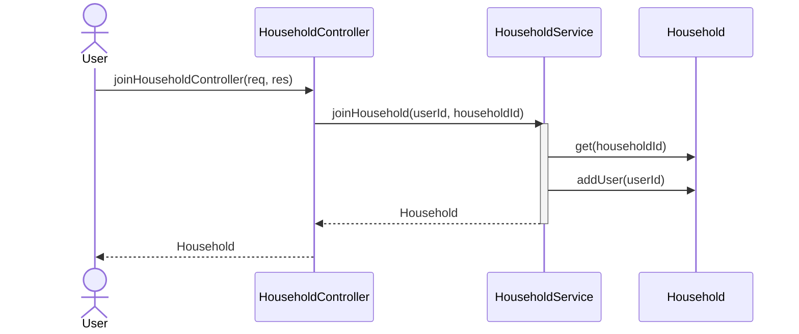
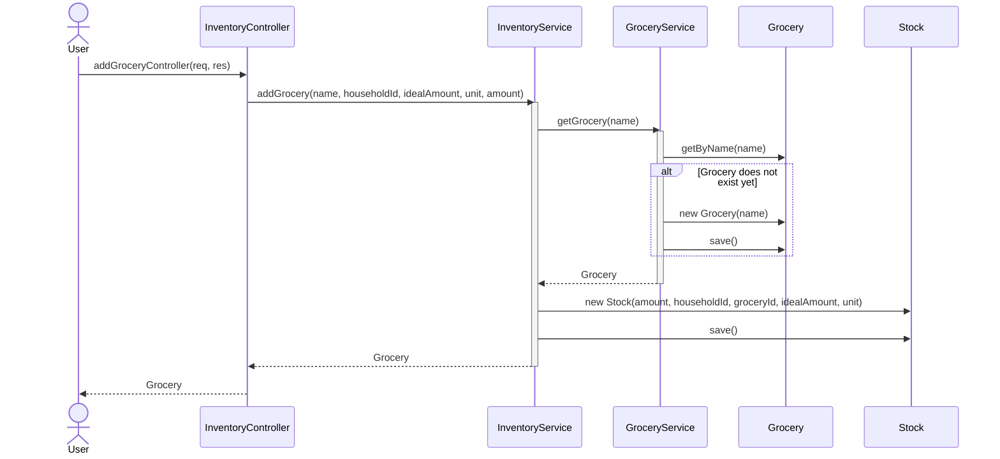
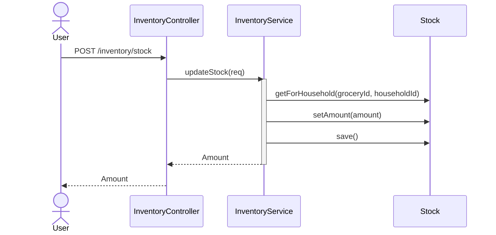
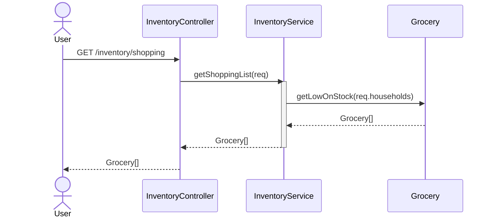

# User Journeys

This section will give a deeper look into some activities that users can perform using wastend.
It will briefly show how the system handles user stories.
Backend logics are represented as Sequence Diagrams, frontend routines are
state diagrams.

## User management

### Onboarding

### Registration

## Household Management

### Create household

### Add user to household

## Inventory Management

### Add groceries

### Update stock value

## Shopping list

### Retrieve shopping list

